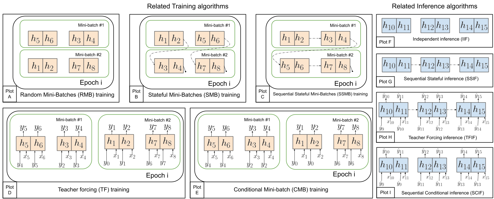
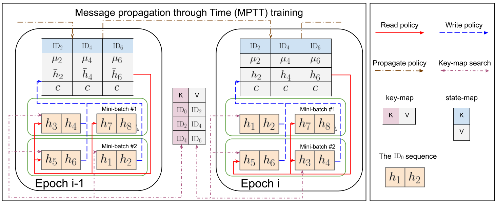

## Introduction
This repository contains the codes, datasets, and pre-trained models used for "Message propagation through time: A training algorithm to retain sample dependency"

Time series modeling, a crucial area in science, often encounters challenges when training ML models like Recurrent Neural Networks (RNNs) using the conventional mini-batch training strategy that assumes independent and identically distributed (IID) samples and initializes RNNs with zero hidden states. The IID assumption ignores temporal dependencies among samples, resulting in poor performance. Stateful training strategies have been proposed to leverage hidden states to maintain relationships between samples. However, they are slow, and their rigid mini-batch structures can lead to unstable training. Other approaches, inspired by dynamical control theory, adaptively estimate responses from RNNs as the system conditions to maintain sample relationships. However, these approaches may struggle when responses encode limited temporal information and are prone to error accumulation during inference. This paper proposes Message Propagation Through Time (MPTT) algorithm to effectively incorporate long temporal dependencies while preserving fast training times relative to the stateful solutions. MPTT utilizes two memory modules to asynchronously manage informative initial hidden states for RNNs, fostering seamless information exchange between samples and allowing diverse mini-batches. MPTT further implements three policies to filter outdated and preserve essential information in the hidden states throughout epochs to generate informative initial hidden states for RNNs, facilitating more robust training compared to stateful RNNs and response-based approaches. Experimental results demonstrate that MPTT outperforms seven baselines on four climate datasets with varying levels of temporal dependencies.




<figure style="text-align: center;">
  
  <figcaption>Testing RMSEs across models trained with various sequence lengths</figcaption>
</figure>

## Dependencies
We provide an 'environment.yml' file to aid in setting up the necessary Conda environment for running our experiments. Please follow these steps to prepare your environment:

1. Install Conda by following the instructions in the [Conda User Guide](https://conda.io/projects/conda/en/latest/user-guide/install/index.html).
2. Create the Conda environment using our provided 'environment.yml' file. For detailed instructions, refer to [this section](https://conda.io/projects/conda/en/latest/user-guide/tasks/manage-environments.html#creating-an-environment-from-an-environment-yml-file) in the Conda User Guide. You can also use the following command:
```bash
conda env create -f environment.yml
```
3. Once the environment is created, activate it with the following command:
```bash
conda activate mptt_exps
```
4. With the environment activated, you are now ready to run the experiments.

## Data and pre-trained models
Please find the data and pretrained models in [this Google Drive folder](https://drive.google.com/drive/folders/1EdZPBTH0G5xg5UBkoz6UcNtLWoltA34M?usp=sharing). 

## Experiment results
To verify the results, please execute the following Jupyter notebooks:
- experiments_general.ipynb
- Impact_of_training_sequence_length.ipynb
- Training_data_size_effects.ipynb
- inverse_sigmoid_decay.ipynb

## Codes
We've provided the code for all 11 learning strategies outlined in Figure 5 of the paper. The code can be found within the scripts folder and follows a consistent convention for all strategies. Here's a breakdown of some key files:
- Train_MPTT_inf_SSIF_demo.py
    - This script is used for training the MPTT algorithm.
- Train_MPTT_inf_SSIF_demo_SW_keeper_1.sh
    - This bash script is used to run the MPTT training with the message keeper set to 1. It also includes the hyperparameters that we used for the experiment in this paper.
- Train_MPTT_inf_SSIF_demo_analysis.ipynb
    - This Jupyter notebook applies the trained models to the testing sets to generate predictions and provides basic analysis for the individual experiment.
- models.py, preprocess.py, and utilities.py
    - These scripts contain the base models and functions shared across experiments.
    

## Directory structure
The project directory is organized as follows:

```
MPTT
│   README.md
|   ...
|   ...
|   experiments_general.ipynb
└───Data
│   1000_year_simulation/
│   
└───results
│   └───head_water_SWAT_1000_years/
│   |   | Train_CMB_inf_SCIF_SF/
│   |   | ...
│   |   | ...
│   |   | Train_TF_inf_TFIF_SW/
│
└───scripts
│   │ Train_RMB_inf_IIF_SSIF_demo.py
│   | ...
│   | ...
│   | Train_EnMPTT_inf_SSIF_demo.py

```


The results and scripts folders serve these roles in our repository:
- results Folder: This folder houses the pre-trained models, learning curve plots, and predictions for experiments. It acts as a reservoir for the outcomes of our research.
- scripts Folder: This folder contains essential codes for conducting the experiments. It includes the scripts for both the training and inference stages and the corresponding bash shells required to execute these experiments.
